<!--

author:   Jihad Hyadi

email:    Jihad.Hyadi@student.tu-freiberg.de

version:  0.0.1

language: de

comment:  Vortrag über die in der Bachelorarbeit geleistete Arbeit und die erreichten Ziele

icon:     https://upload.wikimedia.org/wikipedia/commons/d/de/Logo_TU_Bergakademie_Freiberg.svg

link:     ./styles.css

-->

# Verbesserung des Lernens in Remote Laboren durch Anwendung von Gamification Ansätzen

| Thema             | Info                                                            |
| ----------------- | --------------------------------------------------------------- |
| **Veranstaltung** | `Vortrag zur Erlangung des Bachelors in angewandter Informatik` |
| **Semester**      | `Sommersemester 2024`                                           |
| **Hochschule**    | `Technische Universität Bergakademie Freiberg`                  |
| **Autor**         | `Jihad Hyadi`                                                   |
| **Betreuer**      | `Prof. Dr. Sebastian Zug, Dr. André Dietrich`                   |


# Einleitung

## Hintergrund und Kontext

* Der Einsatz von Remote Laboren in der Ausbildung hat stark zugenommen.
* Edrys, eine Plattform für Remote-Laboren, bietet Studierenden die Möglichkeit, Mikrocontroller aus der Ferne zu steuern und zu programmieren. 
* Gamification ist weithin als erfolgreiche Strategie zur Förderung des Engagements und der Beteiligung.

<!-- --{{1}}--
* insbesondere in Bereichen wie eingebetteten Systemen, wo der Zugang zu physischer Hardware eingeschränkt sein kann. 
* wodurch der Bedarf an physischer Hardware entfällt.
* in verschiedenen Bereichen wie der Bildung anerkannt. 
-->

<div class="flex">
    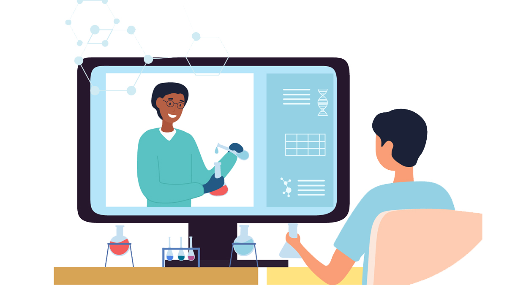
    <figcaption>Remote Labor Bild[1]</figcaption>
</div>

## Problemdarstellung

* Abwesenheit von physischem Kontakt oder direkter Manipulation der Hardware 
* Traditionelle Aufgaben von Remote Laboren vermissen Aspekte der Motivation und Interaktion
* Fehlen von sofortigem Feedback

<!-- --{{1}}--
* kann bei den Lernenden zu einem Gefühl der Abgehobenheit führen, so dass das Verständnis komplexer Konzepte noch schwieriger wird
* die wichtig sind, um ein ausreichendes Wissen über bestimmte komplexe Themen zu erlangen und das Interesse der Teilnehmer zuerhalten.
* kann die Lernumgebung weniger ansprechend sein 
-->

**=> Integration von Gamification-Konzepten in Edrys, um die Motivation und Beteiligung der Studenten zu erhöhen**


## Ziele

* Entwicklung von Gamified-Aufgaben
* Förderung des studentischen Engagements
* Verbesserung der Lernergebnisse
* Bereitstellung unmittelbares Feedback
* Bewertung von Benutzerfreundlichkeit und Benutzererfahrung
* Sicherstellung von Skalierbarkeit und Flexibilität


# Agenda

<!-- style="font-size: 2rem; font-weight: 200;"-->
1. Einleitung
<!-- style="font-size: 2.5rem; font-weight: 600;"-->
2. Verwandte Arbeiten
3. Methodik
4. Implementierung
5. Ergebnisse
6. Fazit


# Verwandte Arbeiten

Frühere Untersuchungen haben gezeigt, dass Remote Labs mit einem besseren Verständnis und einer besseren Erinnerung bei den Studenten verbunden sind, was bedeutet, dass sie neue Prinzipien bequemer lernen können als mit traditionellen Lernsystemen.

<div class="flex mtop">
    
    <figcaption>Verwandte Arbeit Bild[2]</figcaption>
</div>

## Remote Laboren Projekte

### Project MICRO

* MICRO, The Remote Microprocessor Lab
* entwickelt von Studierenden der Informatik, Ingenieurinformatik und Elektrotechnik an der Technischen Hochschule Mittelhessen in Gießen
* Fernzugriff auf mehrere Labore durch Verbindung mit einer virtuellen Maschine
* MICRO-Cube setup

<div class="flex mbottom">
    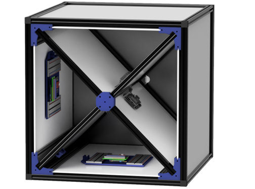
    <figcaption>Prototyp eines MICRO Cube</figcaption>
</div>

-> **Fehlen eines automatischen Einreichungssystems**

<!-- --{{1}}--
das eine direkte Bewertung der von den Studierenden eingereichten Arbeiten und eine sofortige Rückmeldung ermöglicht 
-->


### Edrys

* Einfache Einrichtung und gemeinsame Nutzung von Remote Laboren
* Klassenbildung durch Kombination von Modulen
* Einfache Echtzeit-API zur Erstellung von Modulen (Edrys.js API)

<div class="flex mbottom">
    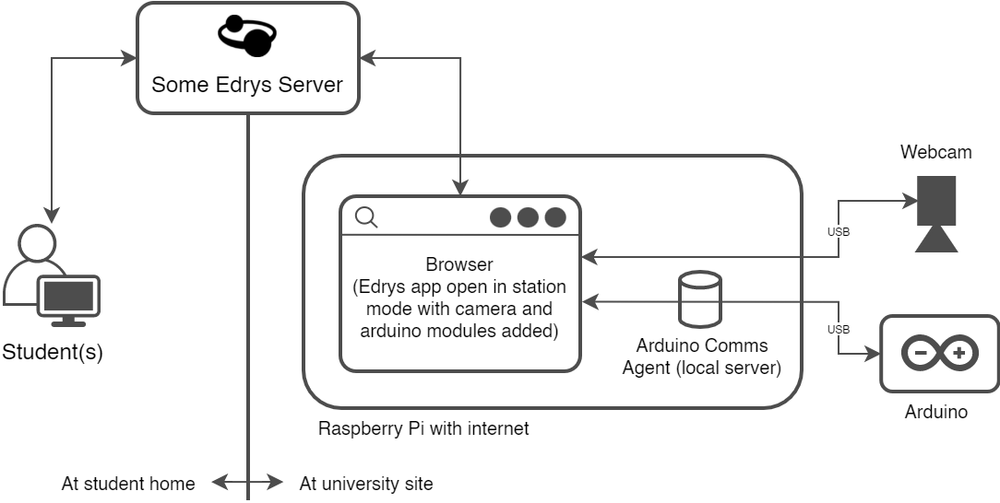
    <figcaption>Beispiel für eine Edrys-Einrichtung</figcaption>
</div>

-> **Aufrechterhaltung eines hohen Engagements und Motivation der Studenten**


## Gamified Remote Laboren Projekte

### RALfie Project

* The Remote Access Labs for Fun, Innovation and Education
* 2013, an der University of Southern Queensland in Australien 
* Steigerung des Engagements junger Lernender in den MINT-Fächern
* Gamifizierte Elemente: Punkte, Stufen und Abzeichen

<div class="flex">
    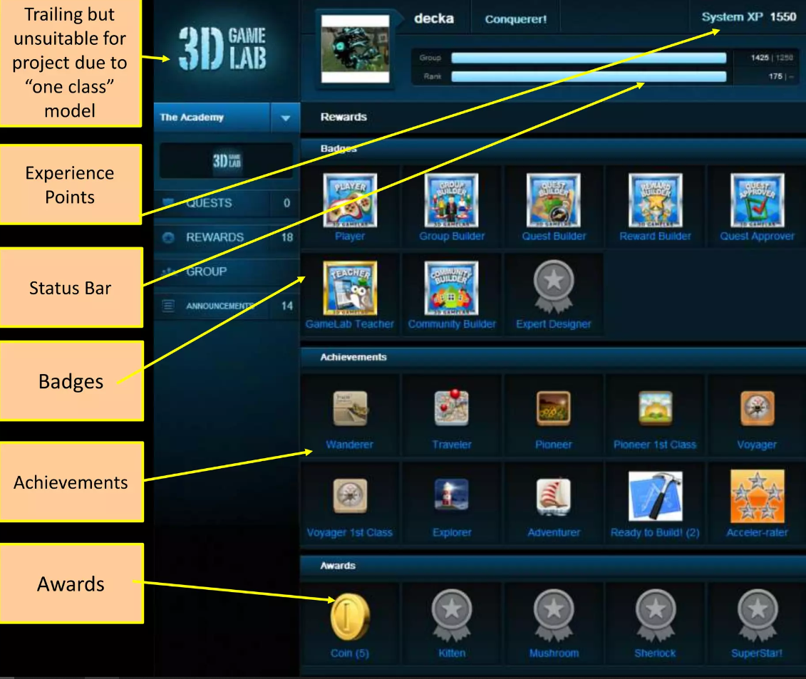
    <figcaption>RALfie Benutzeroberfläche</figcaption>
</div>

-> **einige Lernende hatten Schwierigkeiten, die Plattform zu nutzen, da der Inhalt nicht einfach zu verstehen war.**

### Gamified Remote Labs for Engineering Students

* 2021, während der Zeit der Covid-19-Pandemie, von Forschern der Universität Loughborough im United Kingdom
* eine Reihe von virtuellen Experimenten für Maschinenbaustudenten
* Die Übungen wurden in aufsteigender Reihenfolge der Schwierigkeit eingesetzt
-> **Verwendung von Fragen unterschiedlicher Art**


# Methodik

<div class="flex">
    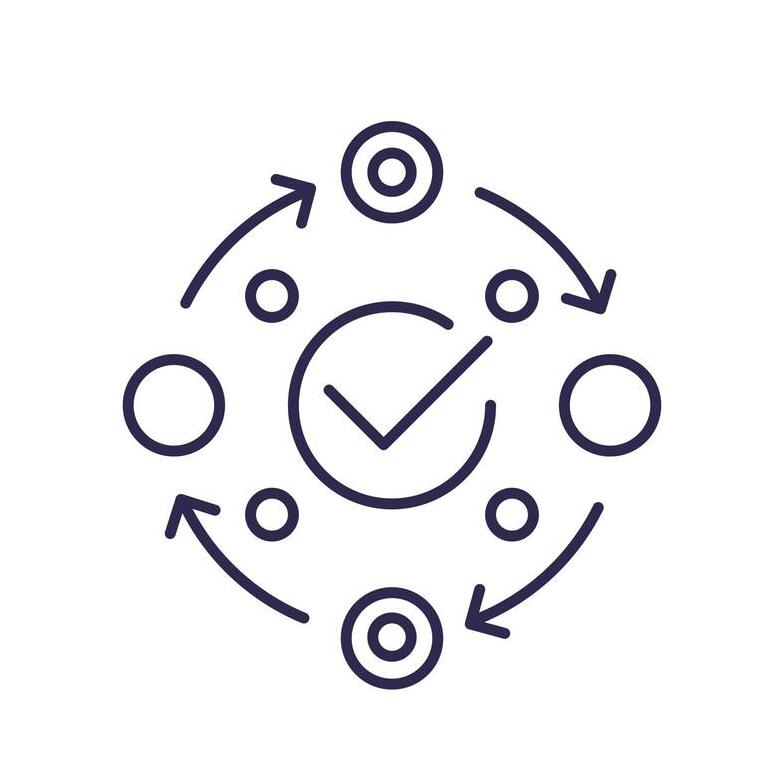
    <figcaption>Methodik-Symbol</figcaption>
</div>

## Systemarchitektur

+ **Präsentationsschicht:** 

  + Benutzeroberfläche, mit der die Studenten interagieren

  + Edrys modules

  + HTML, CSS, JavaScript

+ **Anwendungsschicht:**

  + Kernfunktionalitäten des Systems

  + Verbindung zwischen mehreren Modulen

  + Bearbeitung von Benutzeranfragen in der der Server 

+ **Datenebene:**
  
  + Unterschicht der Präsentations- und Anwendungsschicht

  + Nutzer können Daten wie die für die Lösung einer Aufgabe benötigte Zeit oder Feedback einsehen

  + Ein Sketch, das auf das Board hochgeladen werden muss, wird auf dem Server gespeichert 


## Hauptbestandteile

Zentraler Server:
================

* Entwicklung eines Servers, der sowohl unter Linux als auch unter Windows funktioniert
* Ermöglichung von Code-Tests für Feedback
* Entwicklung mit Node js

**--> Eine schnelle Alternative, um Code von Edrys zu empfangen und auf das Board zu laden**

Module:
================

* Code editor
* Timer
* Multiplayer Tab

**--> Bereitstellung einer ansprechenden Erfahrung für Remote-Laboren**

Gamifizierte Aufgaben:
================

| Name          | Schwierigkeitsgrad |  Erforderliche Module                        | Erforderliche Hardware                                        | 
| ------------- | :----------------: | :------------------------------------------: | :-----------------------------------------------------------: |
| Turn On LED   | leicht             | Code Editor, Timer, Video Stream             | Arduino Uno                                                   |
| Missing LED   | mittelschwierig    | Code Editor, Missing LED Modul, Video Stream | Arduino Uno, Breadboard, 3 LEDS, 3 Resistors, 4 Jumper Wires  |
| RGB LED       | leicht             | RGB LED Modul, Video Stream                  | Arduino Uno, Breadboard, RGB LED, 3 Resistors, 4 Jumper Wires |
| Snake Game    | schwierig          | Code Editor, Video Stream                    | Arduino Uno, 8x8 LED Matrix, 5 Jumper Wires                   |

**--> Umsetzung verschiedener Ansätze, um herauszufinden, welcher am besten geeignet ist, das Engagement der Lernenden aufrechtzuerhalten**


# Implementierung

<div class="flex mtop">
    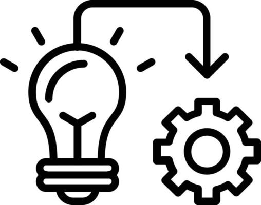
    <figcaption>Implementierung-Symbol</figcaption>
</div>

## Einrichtung des zentralen Servers

<div class="flex mbottom">
    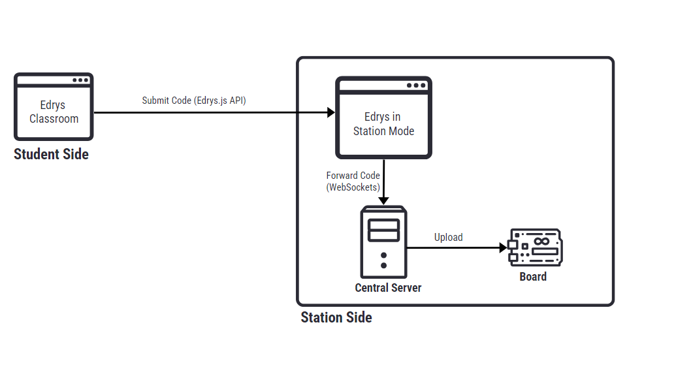
    <figcaption>Upload-Prozess</figcaption>
</div>

**--> Starten des Servers:**

node index.js --core "CORE_NAME" --port "PORT_NAME"

(node index.js --core arduino:avr:uno --port COM3)


### Empfangen und Hochladen von Code

```javascript Eine Funktion zum Kompilieren eines Arduino-Sketches
compileSketch = (sketchPath) => {
    return new Promise((resolve, reject) => {
      const args = ["compile", "--log-level", "error", sketchPath, "-b", BOARD_CORE];
      const compileProcess = spawn("arduino-cli", args);
  
      // Listen for messages and errors in the compilation process
      let stdoutData = ""; 
      let stderrData = ""; 
  
      compileProcess.stdout.on("data", (data) => {
        stdoutData += data.toString(); 
      });
  
      compileProcess.stderr.on("data", (data) => {
        stderrData += data.toString();
      });
  
      // Listen for the completion of the compilation process
      compileProcess.on("close", (code) => {
        if (code === 0) {
          resolve({ message: "Compilation successful!", stdout: stdoutData });
        } else {
          reject({ message: `Compilation failed with code: ${code}`, stderr: stderrData });
        }
      });
    });
};
```

```javascript Eine Funktion zum Hochladen eines Arduino-Sketches auf ein Board
uploadSketch = (port, sketchPath) => {
  return new Promise((resolve, reject) => {
    const args = ["upload", sketchPath, "-p", port, "-b", BOARD_CORE]; 
    const uploadProcess = spawn("arduino-cli", args);

    // Listen for messages and errors in the upload process
    let stdoutData = ""; 
    let stderrData = ""; 

    uploadProcess.stdout.on("data", (data) => {
      stdoutData += data.toString(); 
    });

    uploadProcess.stderr.on("data", (data) => {
      stderrData += data.toString();
    });

    // Listen for the completion of the upload process
    uploadProcess.on("close", (code) => {
      if (code === 0) {
        resolve({ message: "Upload successful!", stdout: stdoutData });
      } else {
        reject({ message: `Upload failed with code: ${code}`, stderr: stderrData });
      }
    });
  });
};
```


### Unit Testing für Feedback

<div class="flex mbottom">
    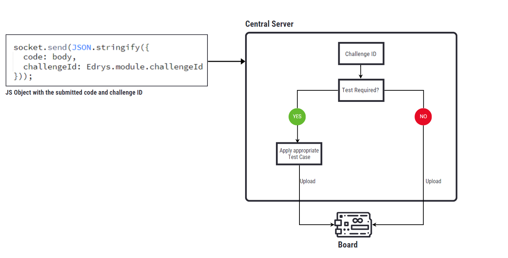
    <figcaption>Server Interner Prozess</figcaption>
</div>


**Beispiel:**

1. Schritt

```c Ein Sketch zum Einschalten der eingebauten LED
void setup () {
  pinMode(LED_BUILTIN, OUTPUT);
}

void loop () {
  digitalWrite(LED_BUILTIN, HIGH);
}
```

2. Schritt

<!-- data-marker="
0 0 0 100 rgba(55,255,100,0.5) text;
4 0 4 200 rgba(55,255,100,0.5) text;
9 0 9 300 rgba(55,255,100,0.5) text;
12 0 15 100 rgba(55,255,100,0.5) text"
data-showGutter="true"
-->
```c Ein Test-Sketch für die Turn On LED Aufgabe
#include <ArduinoUnit.h>

void setup () {
  pinMode(LED_BUILTIN, OUTPUT);
  Serial.begin(9600);
}

void loop () {
  digitalWrite(LED_BUILTIN, HIGH);
  Test::run();
  }

test(turnOnLed){
  assertEqual(digitalRead(LED_BUILTIN), HIGH);
}
```

3. Schritt

``` Eine Testzusammenfassung für den Test
Test summary: 1 passed , 0 failed , 0 skipped , out of 1 test(s) .
```


## Entwicklung von Modulen

### Code Editor

<div class="flex mbottom">
    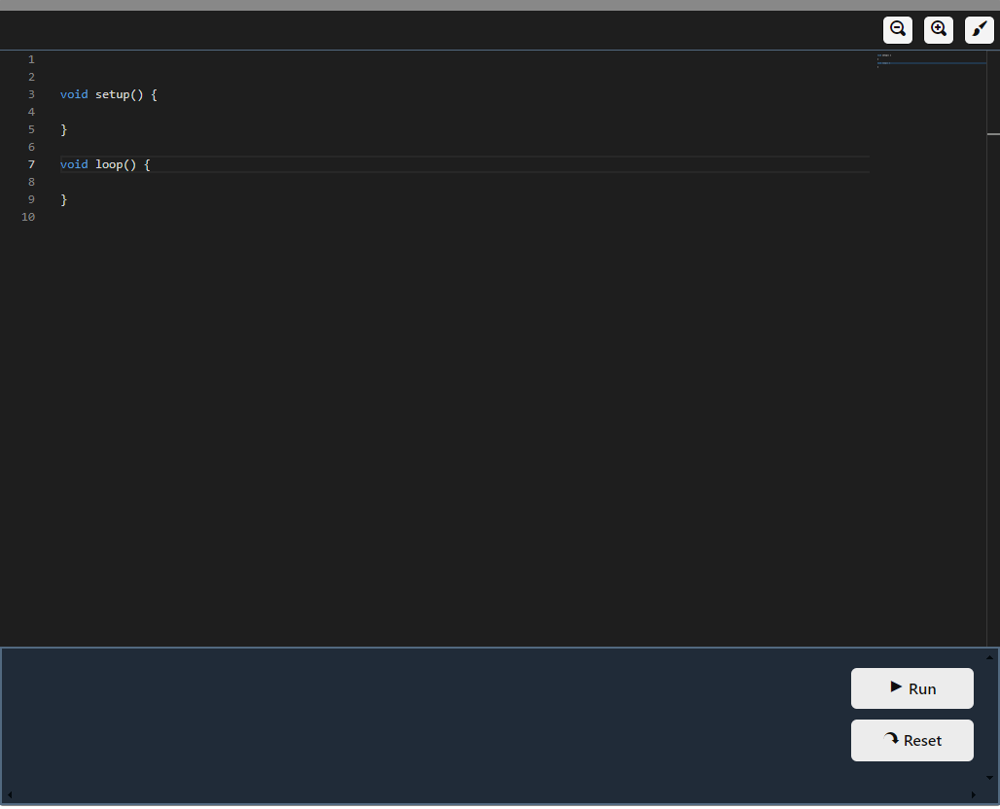
    <figcaption>Code Editor</figcaption>
</div>

```javascript Verbindung des Code Editors mit dem Server
// connect to the websocket server
var socket = new WebSocket(Edrys?.module?.serverURL || "ws://localhost:8080");

Edrys.onMessage(({ from, subject, body }) => {
  if (Edrys.role === "station") {
    // send the code and the challenge id through socket if connected
      if (!socket || socket.readyState !== WebSocket.OPEN) {
        Edrys.sendMessage('server-response', "Error: Server not connected!!");
      } else {
          socket.send(JSON.stringify({
            code: body,
            challengeId: Edrys.module.challengeId
          }));
        }
    }
  })
```

### Timer

<div class="flex mbottom">
    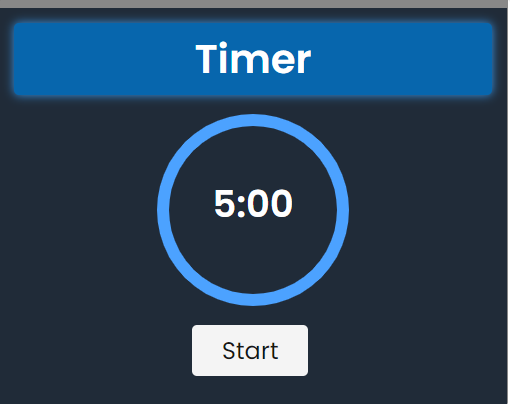
    <figcaption>Timer-Modul</figcaption>
</div>

```javascript Behandlung der vom Code-Editor empfangenen Nachrichten
Edrys.onMessage(({ from, subject, body, module }) => {
  if (subject === "challenge-solved") {
    // Calculate the time needed to solve the challenge
    elapsedTimeInSeconds = timerStart * 60 - time;
    const minutes = Math.floor(elapsedTimeInSeconds / 60);
    const seconds = elapsedTimeInSeconds % 60;

    stopTimer();

    feedbackContainer.classList.add("green-bg");
    setFeedbackMessage(
      minutes > 0
        ? `Congrats! Challenge solved in ${minutes} minutes and ${seconds} seconds!`
        : `Congrats! Challenge solved in ${seconds} seconds!`
    );
  } else if (subject === "pause-timer") {
    pauseTimer();
  } else if (subject === "continue-timer") {
    continueTimer();
  }
}, (promiscuous = true));
```

### Multiplayer Tab

<div class="flex mbottom">
    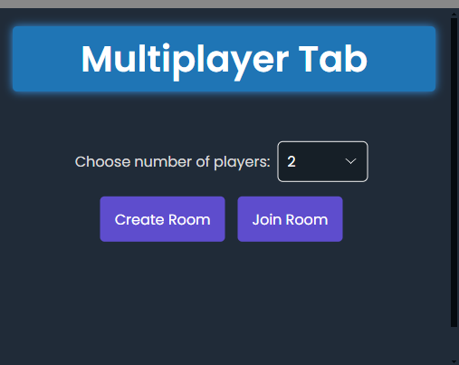
    <figcaption>Multiplayer Tab Modul</figcaption>
</div>

```javascript Eine Funktion zur Aktualisierung der Spieler im Raum
const updatePlayersInRoom = () => {
  joinedPlayers.innerHTML = "";

  const allUsers = Edrys.liveClass.users;
  for (const idx in allUsers) {
    const user = allUsers[idx];

    if (user.room.includes("Station") && !user.displayName.includes("Station") && !usersInStation.includes(user.displayName)) {
      usersInStation.push(user.displayName);
    }
  }

  playersJoinedNumber = usersInStation.length;

  if (playersJoinedNumber >= 0) {
    for (const user of usersInStation) {
      joinedPlayers.innerHTML +=
        user === Edrys.liveUser.displayName
          ? `<div class='main_user'>${user} (Me)</div>`
          : `<div class='user_raw'>${user}</div>`;
    }
  } else {
    joinedPlayers.innerHTML = "<div>No players in room</div>";
  }

  // Enable start game button if all players have joined
  if (playersNumber === playersJoinedNumber) {
    startGameButton.disabled = false;
    spinner.style.display = "none";
  }
};
```

<div class="flex">
    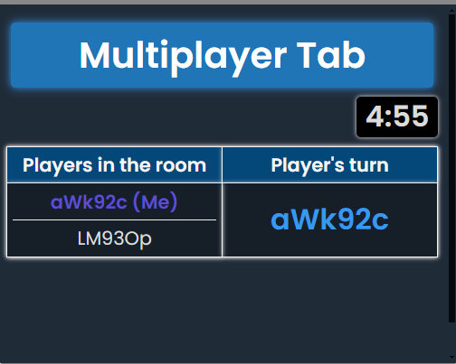
    <figcaption>Multiplayer Tab Modul (Spielbereich)</figcaption>
</div>


## Entwicklung der gamifizierter Aufgaben

### Turn On LED

<div class="flex mbottom">
    
    <figcaption>Turn On LED Lab</figcaption>
</div>

```javascript Code-Editor wartet auf Nachrichten
Edrys.onMessage(({ from, subject, body, module }) => {
    if (subject === "timer-started") {
        // change the editor to writable when the timer starts
        enableEditor();
    } else if (subject === "timer-ended") {
        // change the editor to read-only when the timer ends and reset starter code
        clearEditor();

        disableEditor();
    } 
}, (promiscuous = true));
```


### Missing LED

<div class="flex mbottom">
    
    <figcaption>Missing LED Lab</figcaption>
</div>

```javascript Senden der Nachricht „randomize leds“ an den Server
// connect to the websocket server
var socket = new WebSocket(Edrys?.module?.serverURL || "ws://localhost:8080");

// send a message to the server to start the challenge
startChallenge.onclick = () => {
  Edrys.sendMessage("randomize-leds", "Randomize LEDs!");
};

Edrys.onMessage(({ from, subject, body }) => {
  switch (subject) {
    case "randomize-leds":
      if (Edrys.role === "station") {
        if (!socket || socket.readyState !== WebSocket.OPEN) {
          Edrys.sendMessage("server-not-connected", "Server not connected!");
        } else {
          socket.send(
            JSON.stringify({
              challengeId: "randomize-leds",
              code: "",
            })
          );
  
          Edrys.sendMessage("server-connected", "Server connected!");
        }
      };
      break;
});
```

```javascript Beispiel für die in der JSON-Datei gespeicherten Daten
{
  "turnedOnLEDs": [
    11 ,
    12
  ],
  "turnedOffLED": 13
}
```

### RGB LED

<div class="flex mbottom">
    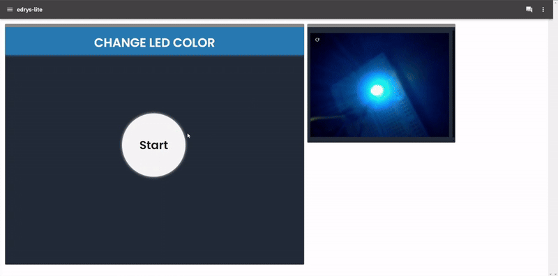
    <figcaption>RGB LED Lab</figcaption>
</div>

```javascript Eine Funktion, die einen Sketch erzeugt, um die RGB-LED-Farbe zu ändern
const finalCode = (chosenColor) => {
    const code = `
        int redPin= 12;
        int greenPin = 11;
        int  bluePin = 13;

        void setup() {
            pinMode(redPin,  OUTPUT);              
            pinMode(greenPin, OUTPUT);
            pinMode(bluePin, OUTPUT);
        }

        void  loop() {
            setColor( ${chosenColor.redValue}, ${chosenColor.greenValue}, ${chosenColor.blueValue}); 
        }

        void setColor(int redValue, int greenValue,  int blueValue) {
            analogWrite(redPin, redValue);
            analogWrite(greenPin,  greenValue);
            analogWrite(bluePin, blueValue);
        }
    `

    return code
};
```


### Snake Game

<div class="flex mbottom">
    
    <figcaption>Snake Game Lab (Multiplayer)</figcaption>
</div>

```c Eine Funktion zur Anzeige eines fröhlichen Gesichts auf der LED-Matrix
void displayHappyFace() {
  reset();

  byte hf[8]= {B00111100,B01000010,B10100101,B10000001,B10100101,B10011001,B01000010,B00111100};

  lc.setRow(0,0,hf[0]);
  lc.setRow(0,1,hf[1]);
  lc.setRow(0,2,hf[2]);
  lc.setRow(0,3,hf[3]);
  lc.setRow(0,4,hf[4]);
  lc.setRow(0,5,hf[5]);
  lc.setRow(0,6,hf[6]);
  lc.setRow(0,7,hf[7]);
  delay(1000);
}
```

```c Eine Funktion zur Anzeige eines traurigen Gesichts auf der LED-Matrix
void displaySadFace() {
  reset();

  byte sf[8]= {B00111100,B01000010,B10100101,B10000001,B10011001,B10100101,B01000010,B00111100};

  lc.setRow(0,0,sf[0]);
  lc.setRow(0,1,sf[1]);
  lc.setRow(0,2,sf[2]);
  lc.setRow(0,3,sf[3]);
  lc.setRow(0,4,sf[4]);
  lc.setRow(0,5,sf[5]);
  lc.setRow(0,6,sf[6]);
  lc.setRow(0,7,sf[7]);
  delay(1000);
}
```


## Integration mit Edrys

* Erstellung einer Konfigurationsdatei (.yml) für jedes Labor
* Die Modulkonfiguration besteht aus verschiedenen Eigenschaften, die vom Modul zur Ausführung bestimmter Aufgaben verwendet werden können

```yml Ein Beispiel für die Konfiguration des Code-Editors
- url: https://jh-488.github.io/Edrys_Code_Editor/index.html
    config:
      editorText: |
        /*
        void setup() {

        }

        void loop() {

        }
      runCommand: execute
      language: cpp
    showInCustom: station
    width: full
    height: huge
    serverURL: ws://localhost:8080
    challengeId: turn-on-led-001
    challengeType: time-restricted
```

```javascript Deaktivierung des Code-Editors, wenn die Aufgabe zeitlich begrenzt ist
Edrys.onReady (() = > {
  if ( Edrys.module.challengeType === "time-restricted") {
    disableEditor();
  }
})
```


# Ergebnisse

<div class="flex mtop">
    
    <figcaption>Ergebnisse-Symbol</figcaption>
</div>

## Bewertung der Leistung

+ **Unit Tests:**

  + Methode zum Testen kleiner Codestücke (Funktionen...)

  + Frühzeitiges Erkennen und Isolieren von Fehlern

  + Jest

```javascript Ein Beispiel für einen Unit-Test mit Jest
test("changeTab hides and shows containers correctly", () => {
    const showContainers = [document.createElement("div")];
    const hideContainers = [document.createElement("div")];
    const displayStyle = "flex";

    // Simulate initial state 
    showContainers[0].style.display = "none";
    hideContainers[0].style.display = "block";

    changeTab(showContainers, hideContainers, displayStyle);

    expect(showContainers[0].style.display).toBe(displayStyle);
    expect(hideContainers[0].style.display).toBe("none");
});
```

<div class="flex mbottom">
    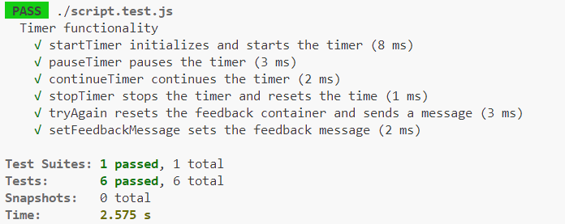
    <figcaption>Testzusammenfassung für das Timer-Modul</figcaption>
</div>

<div class="flex mbottom">
    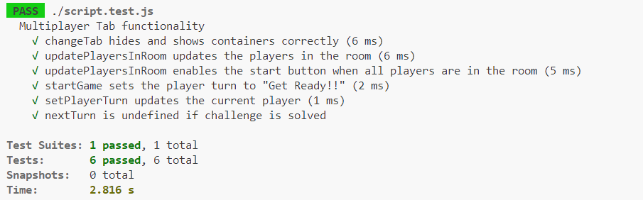
    <figcaption>Testzusammenfassung für das Multiplayer-Tab-Modul</figcaption>
</div>


+ **Integrationstests:**

  + Zu testen, wie die verschiedenen Komponenten miteinander funktionieren

  + Identifizierung der Konflikte zwischen den Elementen 

  + Bewertung der verschiedenen möglichen Szenarien


## Engagement und Feedback der Nutzer

<div class="flex mbottom">
    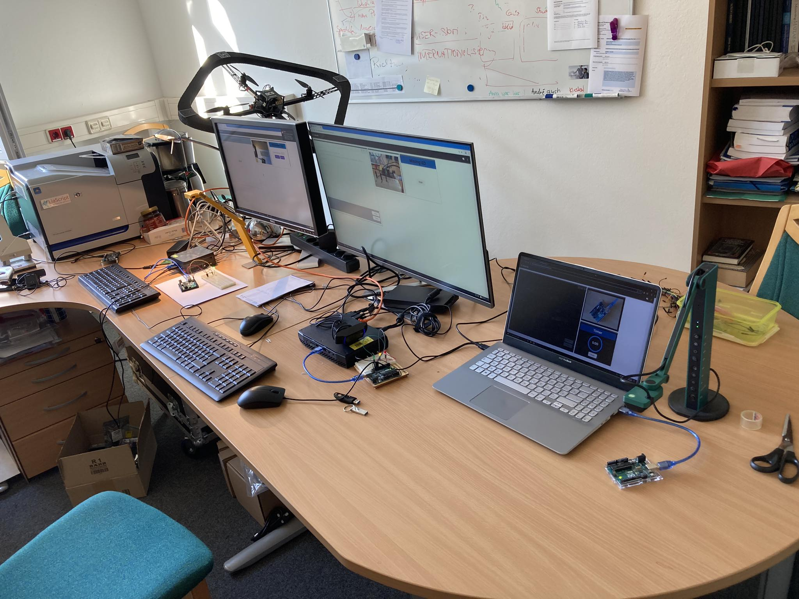
    <figcaption>Einrichtung der Umfragelabore</figcaption>
</div>


<div class="flex mbottom">
    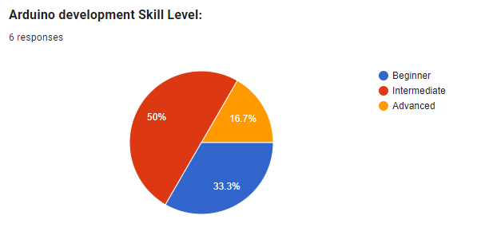
    <figcaption>Arduino-Programmierkenntnisse der Studenten</figcaption>
</div>


<div class="flex mbottom">
    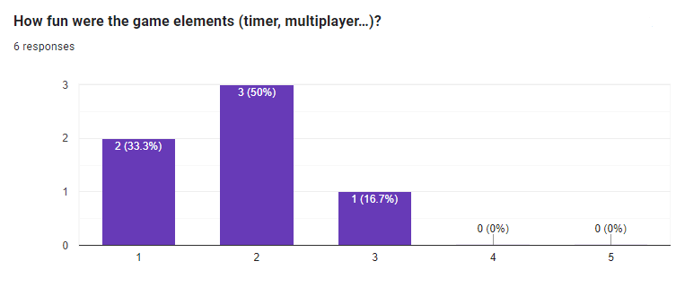
    <figcaption>Diagramm zur Veranschaulichung, wie unterhaltsam die Labore waren (1: „So viel Spaß“, 5: „Langweilig“)</figcaption>
</div>


<div class="flex mbottom">
    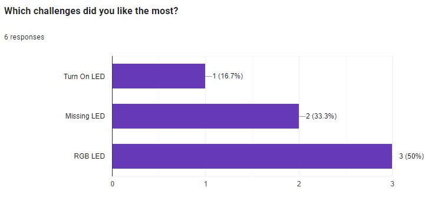
    <figcaption>Ein Vergleich der verschiedenen Aufgaben</figcaption>
</div>


--> **Vorschlag**: die Spieler können gleichzeitig mit der Lösung der Aufgabe beginnen, so dass ein Spieler nicht warten muss, bis er an der Reihe ist.


## Auswertung der Ergebnisse

* Positives Feedback von den Studenten
* Effektive Motivation der Studenten durch die Gamification-Elemente wie einen Timer, einen Multiplayer-Modus und interaktives Feedback 
* Ausgangspunkt für die Entwicklung und den Einsatz von Gamification-Konzepten für Remote Labs in eingebetteten Systemen 

**--> Das am meisten geschätzte Konzept war die sofortige Rückmeldung der Antworten an die Benutzer.**

> “Die automatisierten Tests zeigen am Ende Erfolg oder Misserfolg.”
>
> “Sie erhalten eine direkte visuelle Rückmeldung darüber, ob etwas richtig oder falsch ist.”
>
> “Sie erhalten schnelles Feedback für den Code an einem realen Beispiel. Das Programmieren fühlt sich realer und sinnvoller an.”
>
> -- Antworten der Studenten auf die Frage, welches Element ihnen am besten gefallen hat


# Fazit

<div class="flex">
    
    <figcaption>Fazit-Symbol</figcaption>
</div>

## Erreichung der Ziele

+ **Förderung des Engagements von Studenten**

  + Gestaltung interaktiver Aufgaben, gekoppelt mit einem unmittelbaren Feedback-Mechanismus 

  + Erzielung einer angenehmeren und dynamischeren Atmosphäre

  + Unterstützung der Lernenden beim Erkennen ihrer Fehler durch sofortiges Feedback

+ **Demonstration der Wirksamkeit von Gamification**

  + Die Studierenden fanden die spielerischen Übungen im Vergleich zu traditionellen Lernmethoden angenehmer und ansprechender

  + Der gamifizierte Ansatz ist sowohl unterhaltsam als auch lehrreich

+ **Bereitstellung eines funktionalen und zuverlässigen Systems**

  + Bereitstellung einer reibungslosen und freundlichen Benutzererfahrung

  + Die entwickelten Komponenten können leicht integriert oder weiterentwickelt werden


## Herausforderungen

<!-- style="font-size: 2rem;"-->
* Aufgaben Design
* Feedback in Echtzeit
* Server-Leistung
* Entwicklung gamifizierter Elemente


## Beschränkungen und zukünftige Arbeiten

+ **Stichprobengröße und Vielfalt der an der Umfrage teilnehmenden Studenten**

  + Die aktuelle Studie basiert auf einer relativ kleinen Gruppe von Teilnehmern

  + Die Ergebnisse konnten nicht verallgemeinert werden

  --> Künftige Studien sollten sich an größere und vielfältige Gruppen richten, die mehr Tester mit unterschiedlichem Hintergrund, Programmierkenntnissen und akademischem Niveau umfassen.

+ **Entwurf und Entwicklung von kollaborativen Aufgaben**

  + Lernenden können in einem Team arbeiten, um ein Problem zu lösen

+ **Hinzufügung eines Backend-Servers, der mit einer Datenbank verbunden ist**

  + Verbesserung der Entwicklung von Modulen

  + Einführung neuer Konzepte (Benutzerprofilseite...)

  + Integration eines Punktesystems (Punkte, Abzeichen, Bestenlisten...)


# ‎ 

<div class="flex">
    
    <figcaption>Turn On LED im Multiplayer-Modus</figcaption>
</div>


# Quellenangaben

* [1] https://www.nsta.org/science-teacher/science-teacher-julyaugust-2021-0/remote-labs-20-rescue
* [2] https://www.seattletimes.com/explore/careers/knowing-when-and-how-to-compromise-at-work/